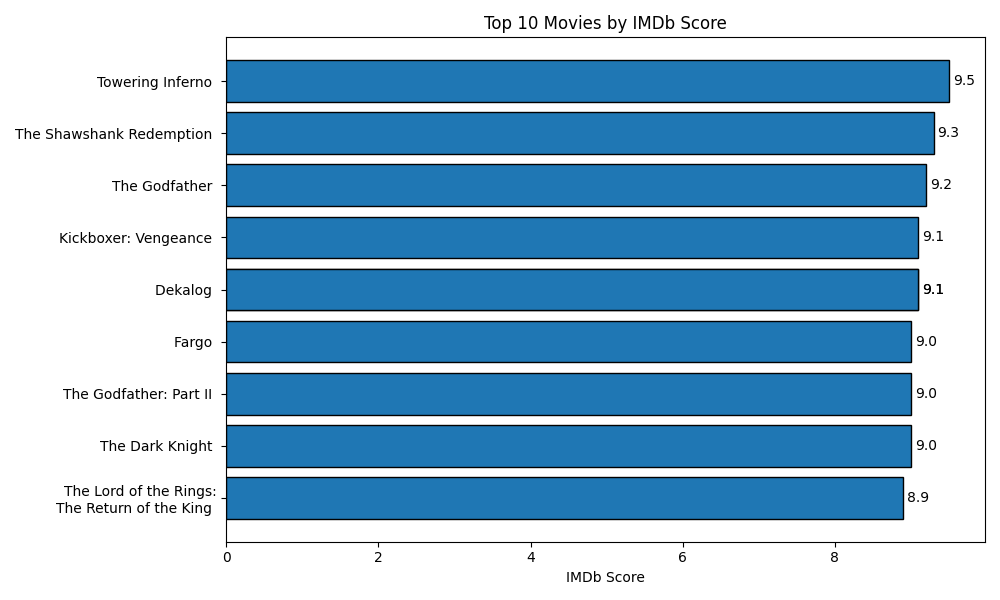

# IMDb Movie Ratings Analysis

This project explores trends in movie ratings using the [IMDb 5000 Movie Dataset](https://www.kaggle.com/datasets/carolzhangdc/imdb-5000-movie-dataset). The goal is to uncover insights into what affects a movie's rating, such as genre, duration, or release year.

---

## Dataset

- File used: 'movie_metadata.csv'
- Source: Kaggle (public dataset)
- Contains 5000+ movies with 28 features, including:
  - 'movie_title'
  - 'genres'
  - 'duration'
  - 'imdb_score'
  - 'gross'
  - 'title_year'

  ---

## Column Descriptions

This section outlines select columns from the movie_metadata.csv dataset used in this analysis. 

- **color**: Film color format (Black and White)
- **director_name**: Name of the movie's director
- **duration**: Runtime in minutes
- **genres**: Genres assigned to the film (pipe-separated)
- **actor_1_name**: Lead actor's name
- **actor_2_name**: Second-billed actor
- **actor_3_name**: Third-billed actor
- **gross**: Box office earnings (USD)
- **budget**: Estimated producction budget
- **title_year**: Year the movie was released
- **imdb_score**: IMDb rating (1–10 scale)
- **movie_facebook_likes**: Facebook likes for the movie page
- **content_rating**: MPAA rating (e.g., PG-13, R)
- **language**: Language of the film
- **country**: Country of production
  
  ---

  ## Project Goals

  - Clean and explore the dataset
  - Analyze distributions of IMDb scores
  - Identify top-rated movies
  - Examine patterns by genre and duration
  - Visualize data with charts

  ---

  ## Tools Used

  - Python 3.11
  - JupyterLab / Jupyter Notebook
  - Pandas
  - Matplotlib

  ---

  ## Sample Insights

  - Most movies have IMDb scores between 5.5 and 7.5.
  - Drama is the most frequent genre.
  - Longer movies (>120 min) tend to have slightly higher average IMDb scores.
  - Top-rated directors often have 3 or more highly rated films.
  - Steven Spielberg has directed the most films in the dataset (26).
  - The top 10 highest-rated films (shown in image) include classics like *The
    Shawshank Redemption*, *The Godfather*, and *The Dark Knight*, with IMDb
    scores ranging from 8.9 to 9.5. 

  ---

  ## Files

  - 'Move_Analysis.ipynb' - Jypyter Notebook with full analysis.
  - 'movie_metadata.csv' - original dataset.
  - 'README.md' - project overview & instructions.
  - 'top_movies.png' - visualization of top-rated films.

  ---

  ## How to Run

  1. Clone or download the repo
  2. Open 'Movie_Analysis.ipynb' in Jupyter
  3. Run the notebook to reproduce the analysis

  ---

  ## Author

  Hallene Brooks 
  GitHub | (https://github.com/HCBrooks-lab) 
